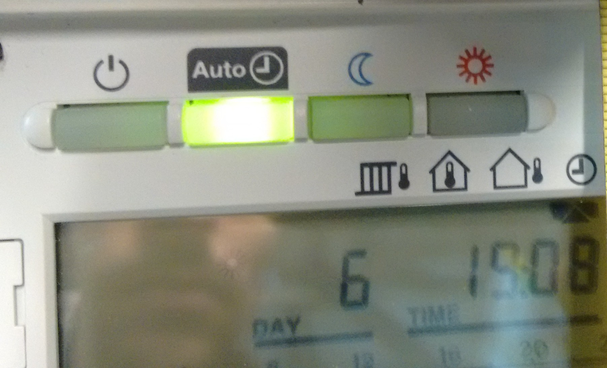
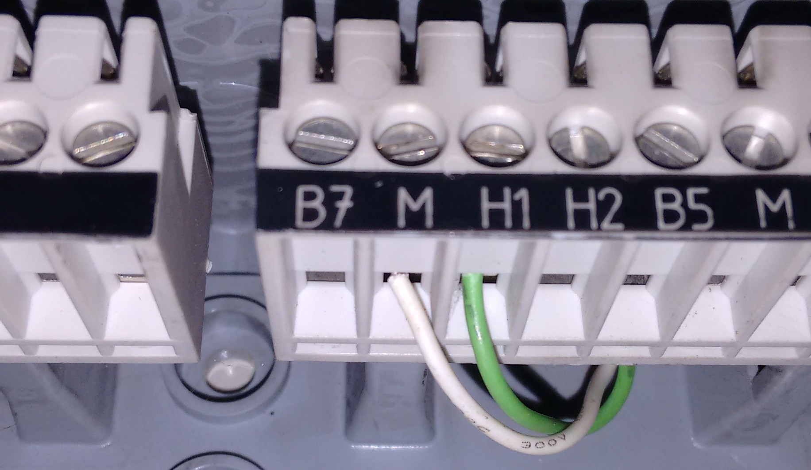
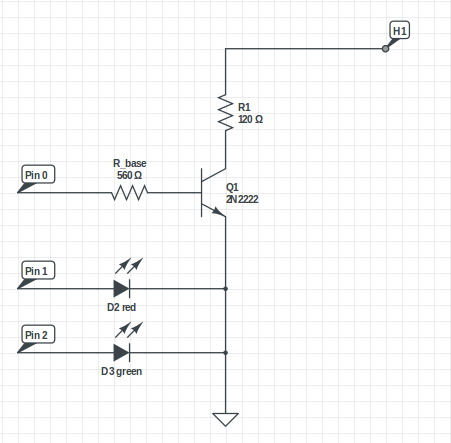

# Chauffe-Marcel

This project allows to remotely control a heating controller.

It was designed to control a Siemens RVL470 but it should work with any heating
controller whose operating mode can be manually overridden.

## Origin

My heating controller - a Siemens RVL470 - is responsible to control the
burner, to regulate temperature according to the required and the external
temperatures. It can be configured accurately to fit your needs and your system
and you should probably not change this configuration yourself.

The Siemens RVL470 also features a mode in which you can configure the hours
it should heat your home (weekly program). It is quite complete and you can
even configure your holiday schedule to avoid unnecessary heating.

But because I never leave my work at fixed hours I wanted more control over
heating time slots. Additionally I rarely stay at home the week-end so I wanted
to be able to completely turn off the heating mode.

## Operating modes

The Siemens RVL470 provides 4 modes:

From left to right:
- `Standby` (Heating is switched off)
- `Automatic` (Automatic changeover from NORMAL to REDUCED according to weekly program and holiday schedule)
- `Continuous REDUCED heating`
- `Continuous NORMAL heating`

The interesting part of the RVL470 is that the operating mode can be manually
overridden. The [documentation](https://www.downloads.siemens.com/download-center/Download.aspx?pos=download&fct=getasset&id1=17600)
informs us that if the contact H1 is bridged to the ground, then we can force
a mode.

The main drawback I see in the RVL470 is that we can not directly select the
mode to force. We can only bridge or not the contact H1 and the ground, so it
is a simple on/off override.

What we can configure is the mode that will be forced when bridging H1 and the
ground. The documentation says that operating line 172 can take values from
0 to 3. Is also adds that "the RVL470 will resume the operating mode previously
selected" when H1. So here is our plan :

We will put the RVL470 on `Continuous REDUCED heating` and we will configure
the mode forced on `NORMAL heating`.

Hence we will only need a simple electronic circuit to behave like a switch
between H1 and the ground :

- the circuit receives a 1, the switch is closed, the operating mode is forced to `NORMAL heating`
- the circuit receives a 0, the switch is open, the operating mode is back to `Continuous REDUCED heating`

## Electronic Circuit

The switch role will be played by a simple transistor operating in saturation
mode. I choose a common NPN transistor, 2N222A. For easier debugging I also
added red and green leds.

This circuit will be controlled by a [Particle Photon](https://store.particle.io/products/photon),
a cheap but powerful Wi-Fi connected micro-controller.

## Server

The Particle allows to control the heating controller remotely through
Particle's cloud API, so why adding a server in the project?

Because overriding the operating mode means that the automatic mode (with
clock) is no longer available. So we need a server to be responsible of the
clock system. And this can be accomplished by a simple cron running on the
server.

The server was planned with 3 modes (checkout its [README](server/README.md)).

## Components

This project consists of several components:

- [`server`](server/), a PHP application - exposing a REST API, storing configuration and calling Particle's endpoints
- [`config`](config/), JSON schema and swagger of server's API
- [`particle`](particle/), code running on the Particle

A mobile application is planned.
