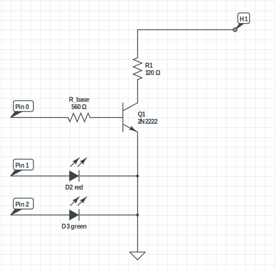

# Particle component

This directory contains the Particle part of Chauffe-Marcel. It's a simple
script that runs on top of a [Particle Photon](https://store.particle.io/products/photon).

Its role is to receive commands from the server through Particle's cloud API
and to turn on or off the heating controller.

## Endpoints

This script makes the Particle expose 2 functions, `enable` and `disable`.
When enabled, the Particle will make the circuit bridge the two pins of the
heating controllers. When disabled, it will open the switch.

The Particle also exposes an endpoint to retrieve the current value of the
boolean `status` variable.

You call can one of these 3 endpoints through Particle's cloud API:

`POST/GET https://api.particle.io/v1/devices/{device Id}/{endpoint}?access_token={access token}`

Checkout [Particle documentation](https://docs.particle.io/guide/getting-started/intro/photon/)
for more details.

## Pins

The script expects 3 outputs pins:
- D0, connected to the transistor's base
- D1, connected to the red led anode
- D2, connected to the green led anode

